## Agenda

- Introduction
- Motivation
- utk-web
- Outlook

# Introduction

## Hello, I am Daniel :-)

:::::::::::::: {.columns}
::: {.column width="42%"}
{ width=100% }
:::
::: {.column width="58%"}
### Work and education
- IT security and computer science
- software engineer
- infrastructure and web
- applications and UI

### Open Source contributions
- hardware and firmware
- operating systems
- software distributions
- reverse engineering
:::
::::::::::::::

## App Development

:::::::::::::: {.columns}
::: {.column width="42%"}
### Domain

- models
- flow
- business logic
:::
::: {.column width="58%"}
### Environment

- platform
- APIs
- frameworks
:::
::::::::::::::

## UX/UI Design

:::::::::::::: {.columns}
::: {.column width="42%"}
### Aesthetics

- shapes
- colors
- spacings
- typography
- icons
:::
::: {.column width="58%"}
### Functionality

- widgets
- inputs
- visualizations
- animations
- placement
:::
::::::::::::::

## UX: Scrolling

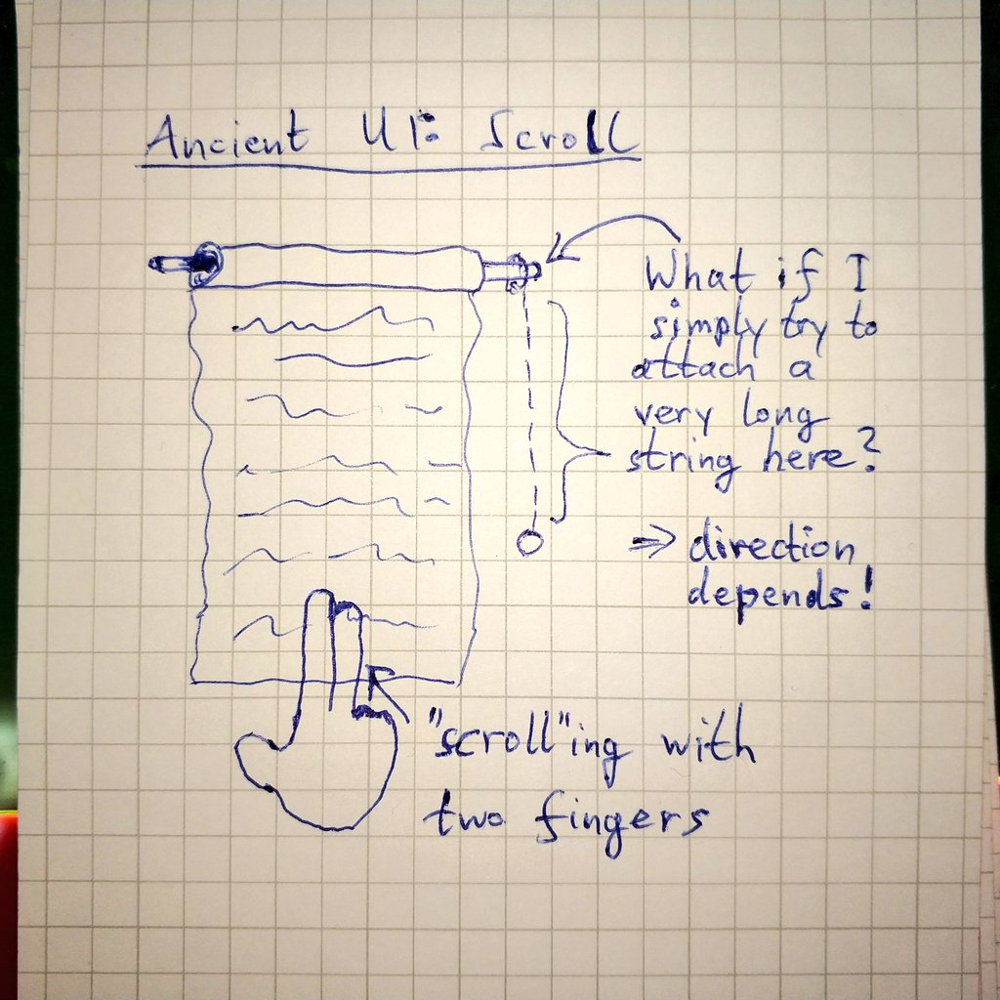{ height=82% }

## UEFI on platforms

:::::::::::::: {.columns}
::: {.column width="22%"}
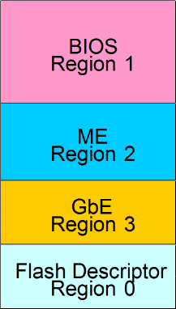
:::
::: {.column width="78%"}
- UEFI only part of typical laptop/desktop/server platform firmware
- full image differs depending on vendor, OEM, etc
  * Intel: IFD, UEFI in "BIOS" region
- UEFI comprises [many specs](https://uefi.org/specifications)
  * ACPI, UEFI, Shell, Platform Init, TCG
- concepts: phases, firmware volumes, filesystems
:::
::::::::::::::

## UEFI Boot Flow

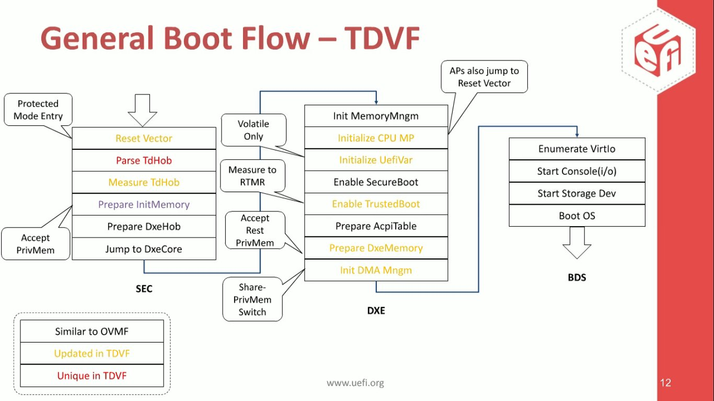

# Motivation

## Security Investigation

[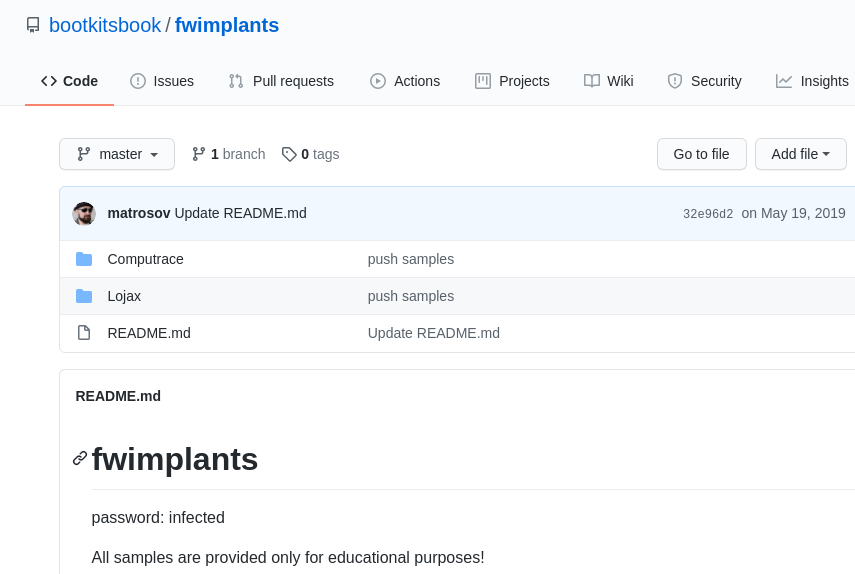](
https://github.com/bootkitsbook/fwimplants)

## Agile and Open

UX/UI design and hardware design/manufacturing are both still learning about agile and open processes.

> We need more tools, feedback, and improvement.

- for education
- for (security) research
- for transparency
- for sustainability
- to allow fixing issues oneself or have others do it

## Other Tools

- [AMI's Module Management Tool (MMTool)](
https://www.ami.com/ami_downloads/Aptio_MMTool_Data_Sheet.pdf)
- Intel FMMT
- ifdtool
- UEFITool
- uefi-firmware-parser
- PSPTool
- MFT (Mimoja's Firmware Toolkit)
- MEAnalyzer
- mecleaner
- ...

## Trees and Tables

:::::::::::::: {.columns}
::: {.column width="62%"}
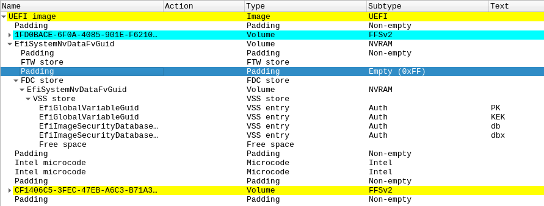
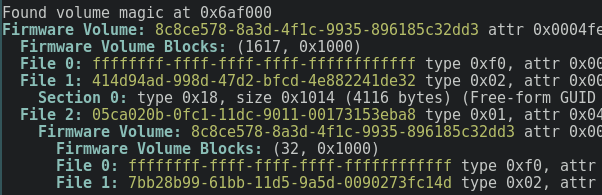
:::
::: {.column width="38%"}
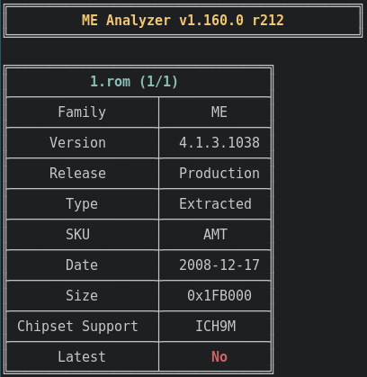
:::
::::::::::::::

# utk-web

## How it started

- render flash usage from `fmap` fixtures
- inspiration from [*iutk2*](https://github.com/linuxboot/fiano/pull/306)

:::::::::::::: {.columns}
::: {.column width="52%"}
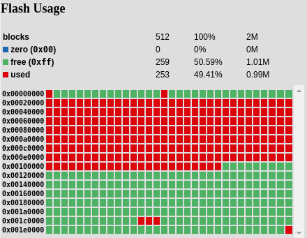
:::
::: {.column width="48%"}
- color palette suitable for color-blind people
- blocks display usage: free, used, all-zero
:::
::::::::::::::

## Current State

- prototype with some general UI components: `Directory`, `Entry`, `Fmap`, quick navigation bar

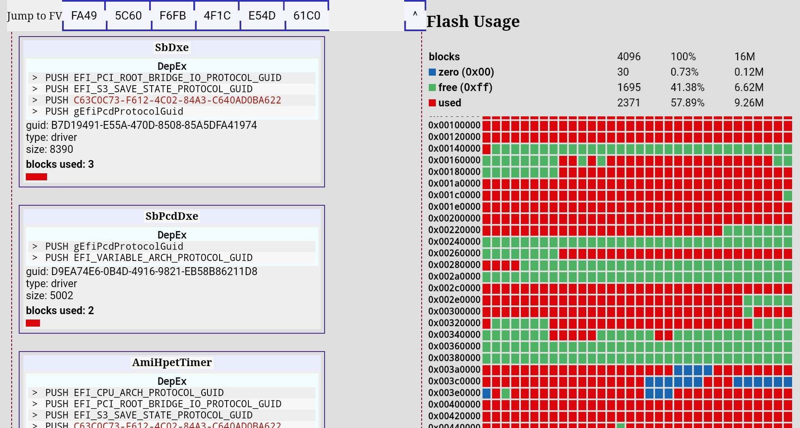

## Integration (PSP)

- added JSON output to fmap and PSPTool

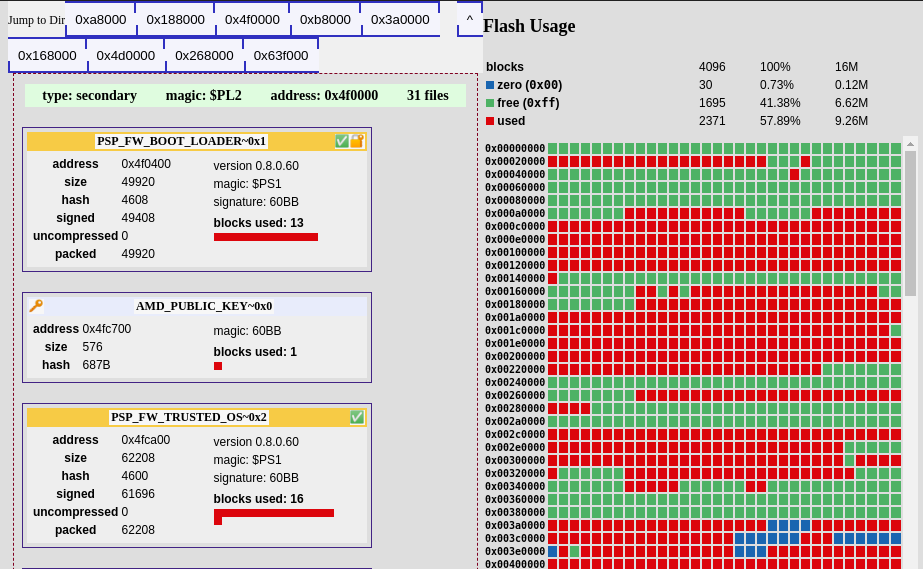

## Integration (uefi-firmware-parser)

- added JSON output to uefi-firmware-parser
- tab navigation for switching between views

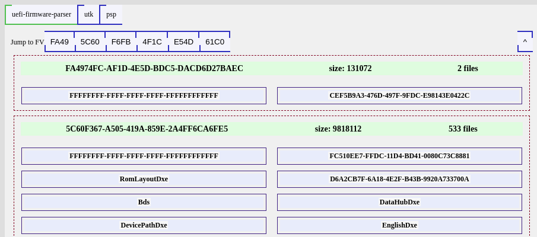

## Transforms

```js
export const flattenVolumes = (volumes) => {
  return volumes.reduce((acc, curr) => {
    if (curr.Value.Files) {
      curr.Value.Files.forEach((f) => {
        if (f.Type === FILE_TYPE_FV_IMAGE) {
          getFvsFromFile(f).forEach((fv) => {
            acc.push({ parent: f, ...fv });
          });
        }
      });
    }
    acc.push(curr);
    return acc;
  }, []);
};
```

## Things I found

### Why is there an SMTP client in my firmware?

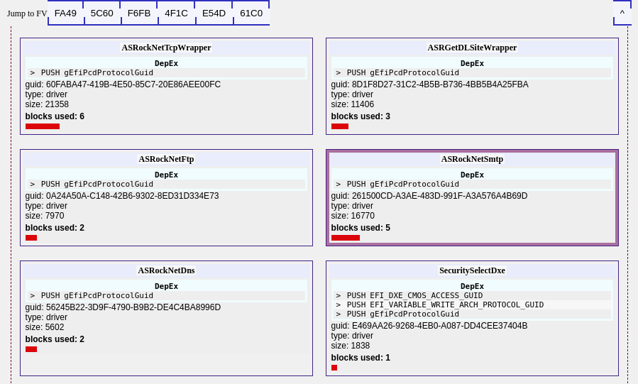

# Outlook

## Future Integrations

- in-browser backends based on WASM
- MFT
- MEAnalyzer, mecleaner, meimagetool...
- UEFITool, ...

# Questions?

## Links

### utk-web

[https://github.com/orangecms/utk-web/](
https://github.com/orangecms/utk-web/)

### Slides

[https://metaspora.org/introducing-utk-web-rc3.pdf](
https://metaspora.org/introducing-utk-web-rc3.pdf)

[https://github.com/orangecms/introducing-utk-web/](
https://github.com/orangecms/introducing-utk-web/)
