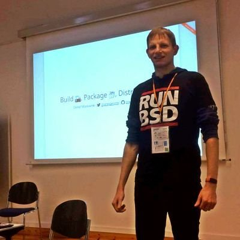

## Agenda

- Introduction
- Motivation
- utk-web
- Outlook

# Introduction

## Hello, I am Daniel :-)

:::::::::::::: {.columns}
::: {.column width="42%"}
{ width=100% }
:::
::: {.column width="58%"}
### Work and education
- IT security and computer science
- software engineer
- infrastructure and web
- applications and UI

### Open Source contributions
- hardware and firmware
- operating systems
- software distributions
- reverse engineering
:::
::::::::::::::

## UX/UI

### Aesthetics vs Functionality

## UEFI

# Motivation

## Agile and Open

UX/UI design and hardware design/manufacturing are both still learning about agile and open processes.

> We need more tools, feedback, and improvement.

# utk-web

## Current State

- prototype
- started with fixtures from utk
- added JSON output support to fmap, PSPTool, and uefi-firmwareparser

# Outlook

## Future Integrations

- in-browser backends based on WASM
- MFT
- MEAnalyzer, mecleaner, meimagetool...
- UEFITool, ...

# Questions?
